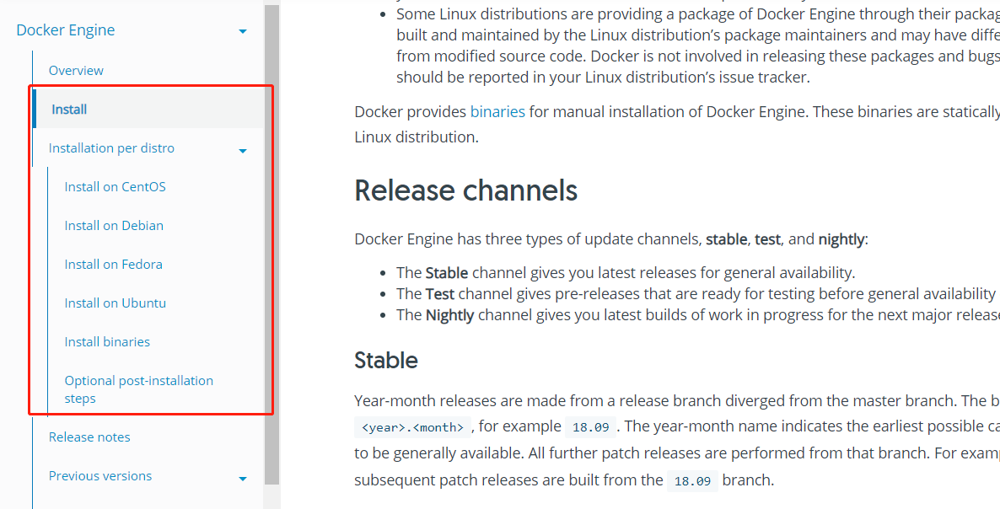

# Docker

Docker 是一个开源的应用容器引擎，基于 [Go 语言](https://www.runoob.com/go/go-tutorial.html) 并遵从 Apache2.0 协议开源。

Docker 可以让开发者打包他们的应用以及依赖包到一个轻量级、可移植的容器中，然后发布到任何流行的 Linux 机器上，也可以实现虚拟化。

容器是完全使用沙箱机制，相互之间不会有任何接口（类似 iPhone 的 app）,更重要的是容器性能开销极低。

# 安装

## windows & MacOs

windows和MacOs都可以直接安装桌面版

地址:https://www.docker.com/products/docker-desktop

## Linux系列

可以参考官网 https://docs.docker.com/engine/install/



## 简单命令

```shell
## 查看镜像
docker images
## 查看正在运行的容器
docker ps
## 查看所有容器
docker ps -a
```

