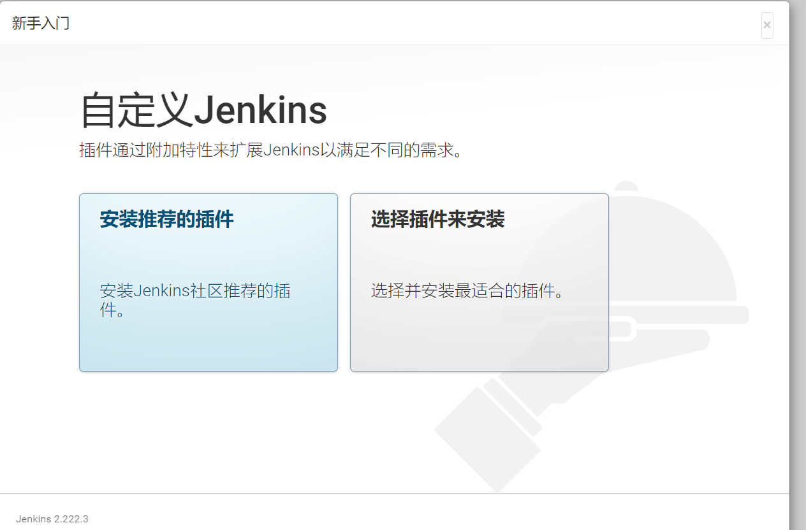

# Jenkins

Jenkins是开源CI&CD软件领导者， 提供超过1000个插件来支持构建、部署、自动化， 满足任何项目的需要。


## 利用Docker安装Jenkins

```bash
docker run \
  -d \
  --rm \
  -u root \
  -p 8080:8080 \
  -v jenkins-data:/var/jenkins_home \
  -v /var/run/docker.sock:/var/run/docker.sock \
  -v "$HOME":/home \
  --name creat_jenkins
  jenkinsci/blueocean
```

将容器中的 `/var/jenkins_home` 目录映射到 Docker [volume](https://docs.docker.com/engine/admin/volumes/volumes/) ，并将其命名为 `jenkins-data`。如果该卷不存在, 那么 `docker run` 命令会自动为你创建卷。

将主机上的`$HOME` 目录 (即你的本地)映射到 (通常是 `/Users/` 目录) 到容器的 `/home` 目录。

```bash
## 执行命令可以进入容器
docker exec -it creat_jenkins bash
```

容器启动可以访问http://localhost:8080 进入jenkins

## 安装向导

第一次访问需要对jenkins进行解锁

### 解锁Jenkins

1. 访问http://localhost:8080 会出现 **Unlock Jenkins** 页面


2. 进入终端命令,获取密码

   ```bash
   ## 进入终端
   docker exec -it creat_jenkins bash
   ## 进入initialAdminPassword获取密码
   cat /var/jenkins_home/secrets/initialAdminPassword
   ```

   

3. 复制添加到文本框内，点继续

### Customize Jenkins

新手推荐安装推荐的插件，后面再根据需求安装其他插件




后面还有设置管理员的，就不一一截图了 比较简单

设置完之后需要重启。需要等一会 -0_0-