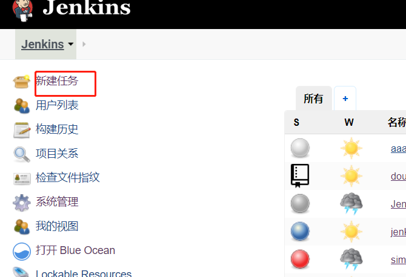
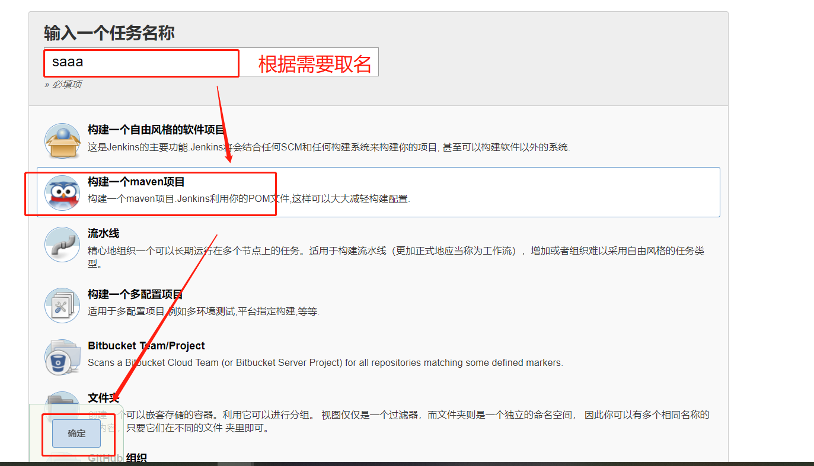
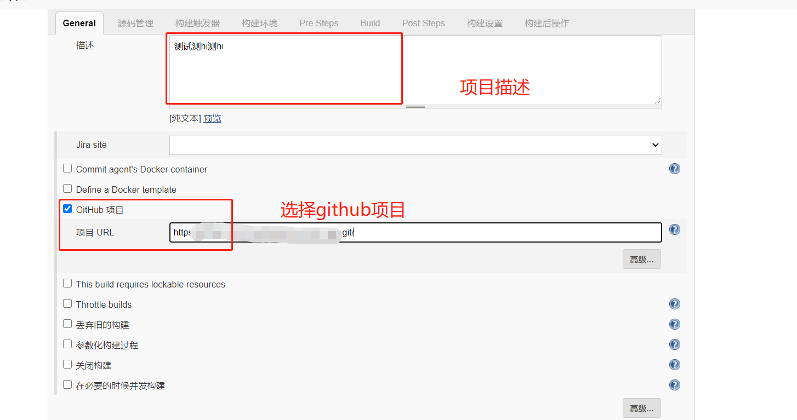
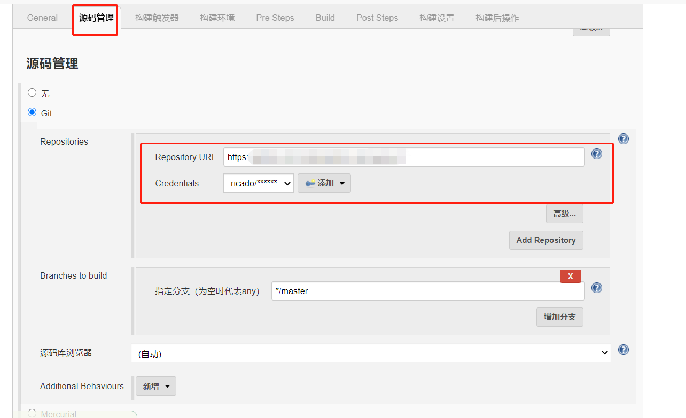
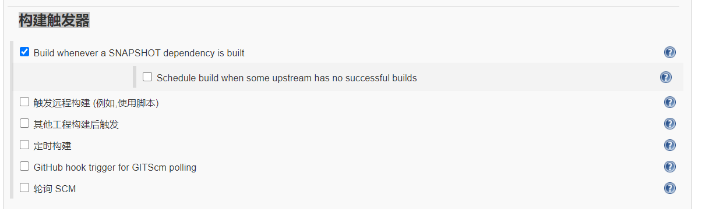
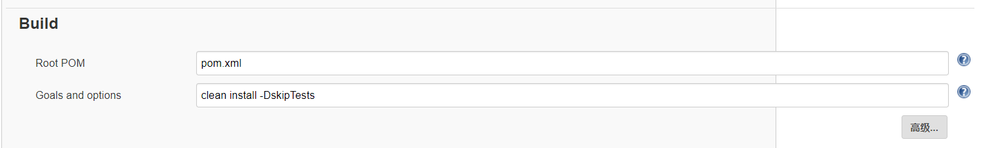
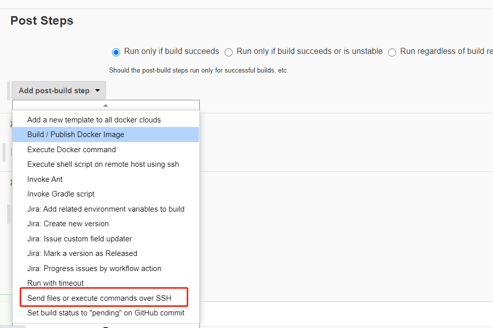
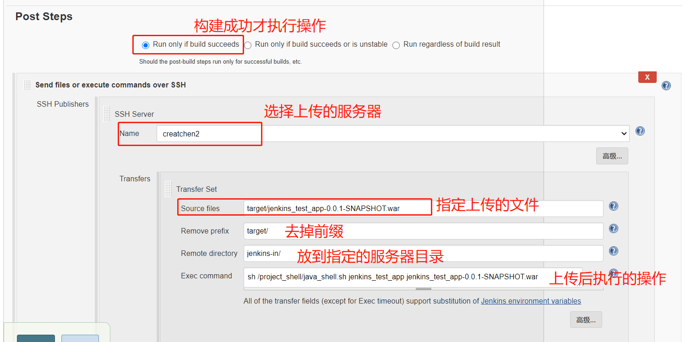

准备一个springboot的项目

### 1.新建任务



### 2.新建一个maven项目



### 3.项目配置



源码管理的[Credentials][Credentials]可以添加。添加输入你对应的github的账号密码


**构建触发器**



构建环境可以不用选

指定构建的pom.xml 以及构建操作clean install -DskipTests



添加构建成功后的操作，选择要上传文件到服务器





执行sh的代码参考

```bash
DATE=$(date +%Y%m%d)
export JAVA_HOME PATH CLASSPATH
JAVA_HOME=/usr/local/lib64/jdk-14.0.1
PATH=$JAVA_HOME/bin:$JAVA_HOME/jre/bin:$PATH
CLASSPATH=.:$JAVA_HOME/lib:$JAVA_HOME/jre/lib:$CLASSPATH
PROJECT_NAME=$1
DIR=/root/
JARFILE=$2

echo "project name:$PROJECT_NAME"
echo "JAR file : $JARFILE"

if [ ! -d $DIR/backup ];then
   mkdir -p $DIR/backup
fi
cd $DIR
## show_str=`ps -ef | grep "java -jar backup/$JARFILE" | grep 'java' | grep -v grep`
## echo "show_str $show_str"
## project_pids=`ps -ef | grep "$JARFILE" | grep 'java' | grep -v grep | awk '{print $2}'`
## echo "111project_pids ${project_pids[*]}"
## if [ ${#project_pids[*]} > 0 ];then
##    echo "项目已经启动了，开始关闭项..."
##    ps -ef | grep "$JARFILE" | grep 'java' | grep -v grep | awk '{print $2}' | xargs kill -9
##    echo "项目关闭成功,开始重启项目"
## else  
##    echo "项目未启动,直接启动"
## fi    
ps -ef | grep "java -jar backup/$JARFILE" | awk '{print $2}' | xargs kill -9
mv /jenkins-in/$JARFILE backup/$JARFILE
echo "try running"
java -jar backup/$JARFILE  > out.log &
if [ $? = 0 ];then
        sleep 30
        tail -n 50 out.log
fi
cd backup/
ls -lt|awk 'NR>5{print $NF}'|xargs rm -rf
```


[Credentials]:https://www.jenkins.io/zh/doc/book/using/using-credentials/	"Credentials"


